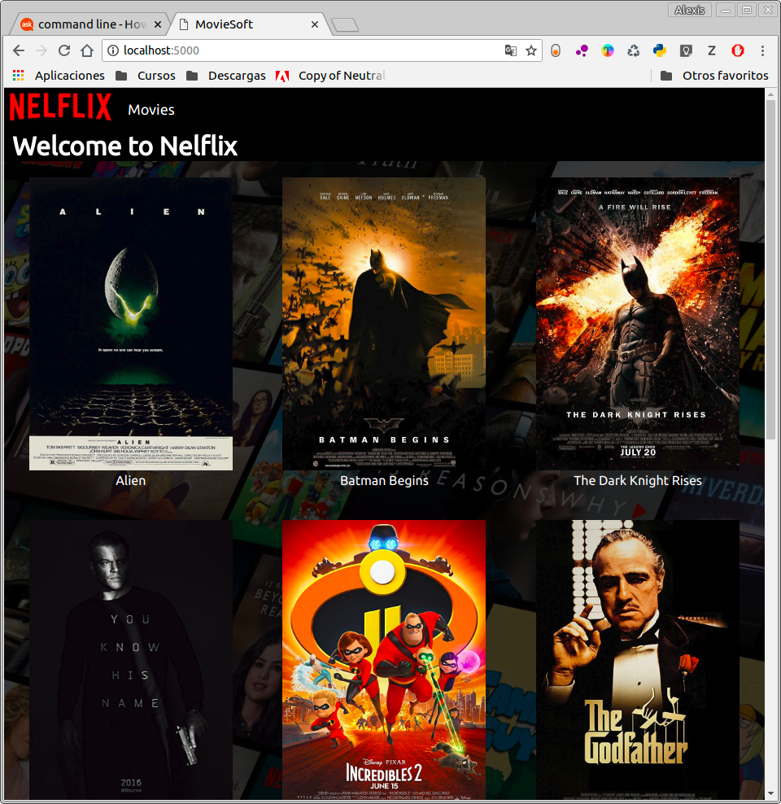
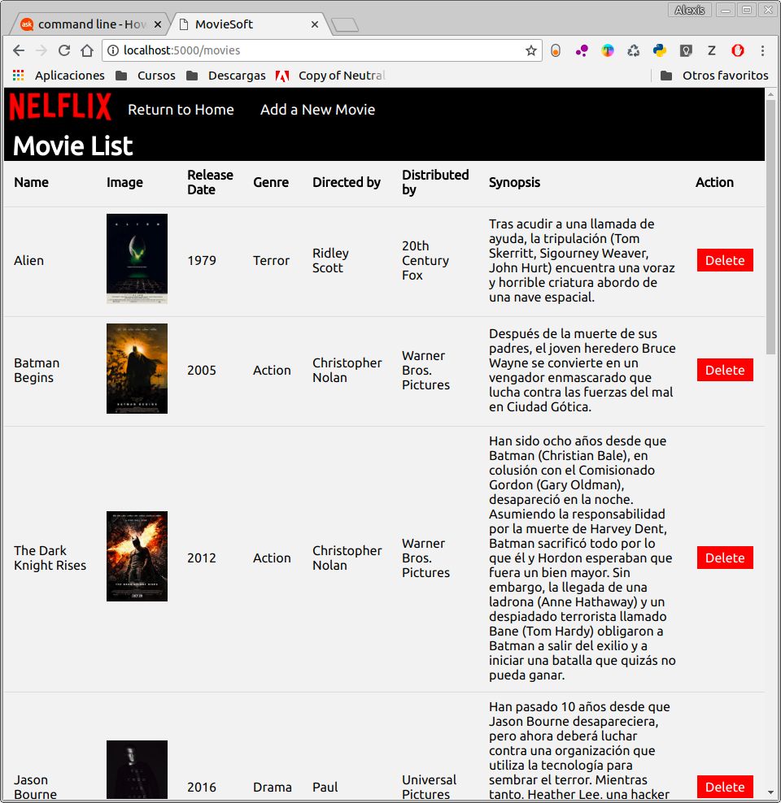
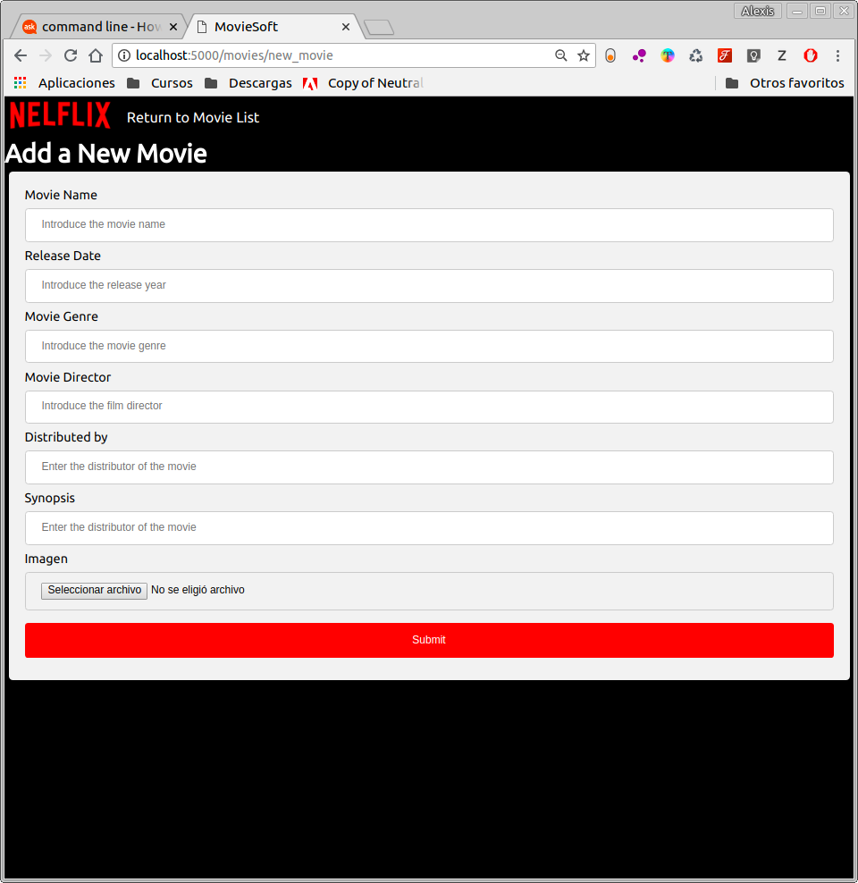
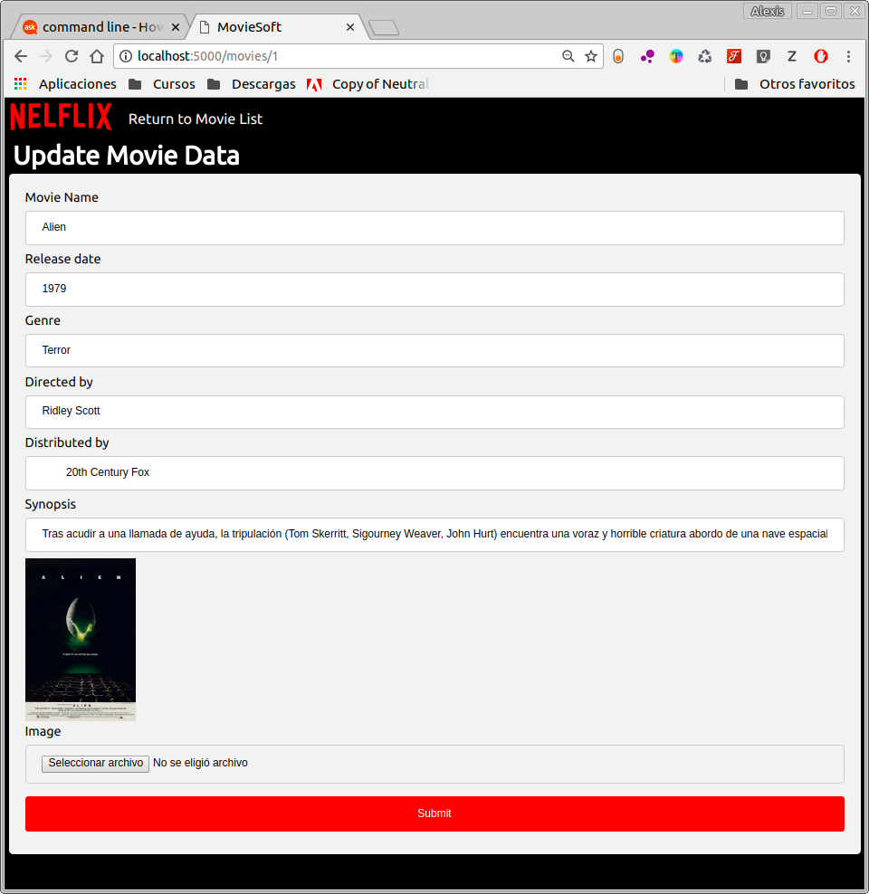

# MovieSoft 2018

## Manual de Uso

Para entrar a la aplicacion de manera local se puede ingresar de dos maneras, usando el http://localhost:5000/ o http://127.0.0.1:5000/

## Mapa del Sitio

- Index(Catalogo de Peliculas)
  - Perfil Pelicula
  - Movies
    - Agregar Nueva Pelicula
    - Modificar Pelicula
    - Eliminar Pelicula

---

## Pantalla de Bienvenida:

Esta es la pagina principal de la aplicacion.
En la parte superior izquierda se encuentra "Movies(Se entra a detalles mas adelante de esta seccion)".  
Ante el usario se muestra el catalogo completo de las peliculas disponibles para ver, el usuario para poder ver la informacion de las peliculas a detalle debe identificar la pelicula que le gusta y darle click, entonces lo llevara a la vista individual de cada pelicula.

---
## Vista individual de Pelicula

Al hacer click a cualquier pelicula en la Pantalla de Bienvenida(Index), se puede acceder a la informacion detallada de la pelicula:

- Nombre Pelicula
- Fecha Lanzamiento
- Director
- Sinopsis
- Imagen de Cartelera
- Genero

---

## MovieList

En esta seccion se accede mediante la pantalla principal pulsando en el Boton "Movies" donde el usuario puede:
- Agregar Nueva Pelicula
- Modificar Pelicula
- Eliminar Pelicula

Cada Pelicula que el usuario agrega o borra se vera reflejado en esta lista.

---

## Add a new movie 

Cuando el usuario pulsa Add a new Movie se muestra este formulario

| Dato del formulario| Que debe Ingresar el usuario|
| -------------------|:---------------------------:|
| Movie Name         | Nombre de la Pelicula|
| Release Date       | Anio de lanzamiento |
| Movie Genre        | Genero de la Pelicula |
| Movie Director     | Nombre del Director o Directores|
| Movie Synopsis     | Una Breve sinopsis de la Pelicula sin revelar asuntos mportantes de la Trama                            |
| Movie Imagen       | Una Imagen de preferencia que sea la Misma Imagen de la Cartelera |

Si el usuario intenta agregar los datos incompletos recibira un error de que los datos no estan completos, es un requisito obligatorio llenar todos los campos, incluido cargar una imagen.

---
## Update a existing movie

Para poder actualzizar una pelicula, se da click sobre cualquier elemento en la MovieList que contenta informacion de esa pelicula, es muy similar a agregar una nueva pelicula, unicamente el usuario modificara los datos ya existentes y por si fuera el caso tambien la imagen, no es un requisito obligatorio 

